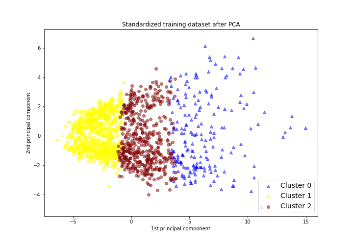
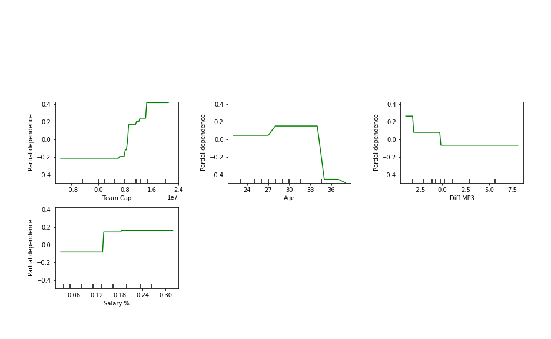
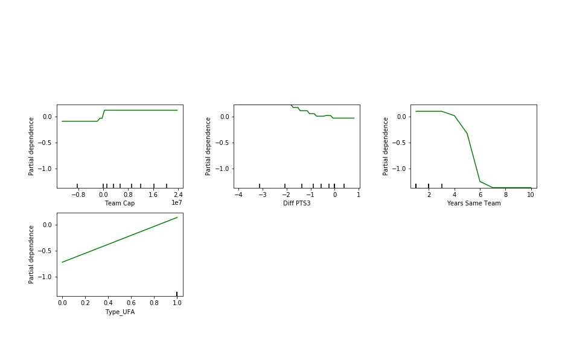
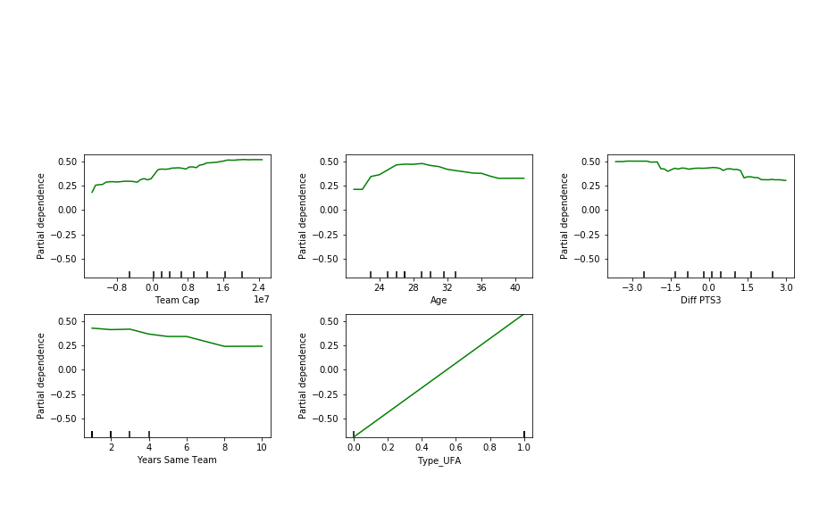

# Predicting when an NBA Player will leave his team

# Table of Contents
1. [Introduction](#intro)
2. [Process] (#process)

#intro
GOAL: 
In recent years there have been more big name players that are leaving their teams and going to play with other teams. They are going to play with friends, going to play where they are paid more, or leaving to go to teams to win a championship. A few recent examples, LeBron James, Kevin Durant, and Kyrie Irving.

This means that teams do not have as much power as they did before. It is sometimes out of their hands when a player wants to leave. MY goal is to accurately predict when a player is going to leave when he is in the last year of his contract. This way teams can adjust and be prepared when their star player leaves.

##Process
PROCESS:
- Webscrape data from websites
- Combine data into dictionaries of each player. The dictionary has a dataframe of the players salary, stats for years from 2009 to present
- Deal with missing data and data that is not uniform across websites
- Explore data
- Salary, stats
- Years with the same team, % of salary cap, whether they made the playoffs or not, difference in minutes played this year from last 3 years, difference in points scored this year from last 3 years, whether they were traded that year or not
- PCA
- Cluster similar players into groups

- Ran a boosting model on each group to predict who is going to churn

HOW TO RUN:
- In scraping.py there is code that will scrape the players statistics, salary, and team data.
    - It then combines and saves this data into a pickle file

RESULTS:
- Clusters are split mostly by games played, games started, and minutes played.
- Group 0 are players that play most games and start most games
- Group 1 are players that play very little games to some games
- Group 2 are players that play most games and either dont start or start some games
# Group 0

# Group 1

# Group 2

IDEAS:
- 

Data sources:
https://www.spotrac.com/nba/
https://www.basketball-reference.com/
https://hoopshype.com/