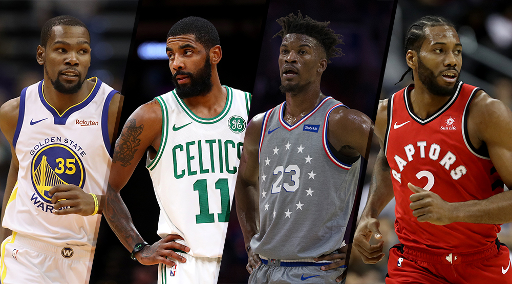

# Predicting when an NBA Player will leave his team

## Table of Contents
1. [Summary](#summary)
3. [Results](#results)
4. [Next Steps](#next)
5. [How to Run](#how_to)
6. [Sources](#source)

### Summary
You can see my full write up at https://medium.com/@steelemarcus89/predicting-when-an-nba-player-will-change-teams-3782412ddbf7

Have you ever wondered what makes a player change teams? Is the player angry because he wasn’t playing enough or scoring enough? Did someone else offer them more money? Or did they leave to go play for a team that has a better chance of winning? Or did the team not want him so he had to go somewhere else?

There were two main reasons why I picked this project. One is because of the increase in big name players that are changing teams now. The other is because of reports and the reasons they give for why they ‘know’ a player is leaving. They always heard something from someone else that made them think that the player is leaving. So I set out to see if I could use data science to predict ahead of time if a player is going to leave or not.

If I get a successful model, a team could use this information to know when someone on their team is going to leave. They could then take whatever actions they need to either convince them to stay or to do what they need to do to make sure they don’t lose that player and get nothing in return. The team could also see players on other teams that are more likely to leave and focus on recruiting those players to come to their team.

### Results

### NEXT STEPS:
- Try other clusters:
    - Group by position of the players
- Make a webapp that will show players and their probability of leaving

### HOW TO RUN:
- In scraping.py there is code that will scrape the players statistics, salary, and team data.
- The data is then saved onto your computer.
- Run model.py to run the model.

 

### Data sources:  
https://www.spotrac.com/nba/  
https://www.basketball-reference.com/  
https://hoopshype.com/  