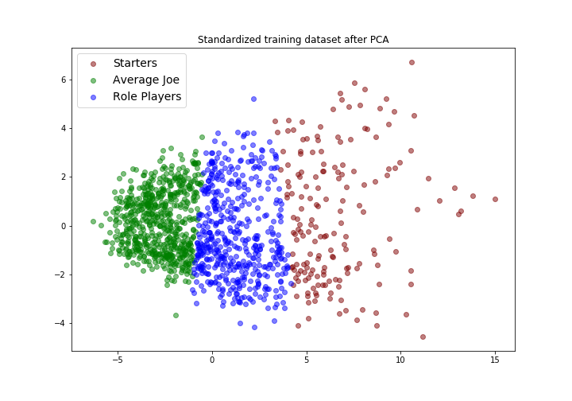

# Predicting when an NBA Player will leave his team

## Table of Contents
1. [Introduction](#intro)
2. [Process](#process)
3. [Results](#results)
4. [Next Steps](#next)
5. [How to Run](#how_to)
6. [Sources](#source)

### Introduction:  
In recent years there have been more big name players that are leaving their teams and going to play with other teams. They are going to play with friends, going to play where they are paid more, or leaving to go to teams to win a championship. A few recent examples, LeBron James, Kevin Durant, and Kyrie Irving.

This means that teams do not have as much power as they did before. It is sometimes out of their hands when a player wants to leave. MY goal is to accurately predict when a player is going to leave when he is in the last year of his contract. This way teams can adjust and be prepared when their star player leaves.

### PROCESS:   
First I webscraped data from a couple different websites. I gathered stats data from 2009 to the present, salary data from 2011 to the present, and team data from 2011 to the present. I have more data on the players stats so I can look at how their previous stats affected if they would leave or not.  
After scraping all this data, I combined it all together so I could run it through a model to test it.  

The next step was to explore the data. After looking at the data I noticed that players salaries seemed to go up every year. That makes sense because the salary cap in the NBA was going up every year. (Mostly because they were making more money from TV deals)  
  
I read about players salaries a little bit and learned that most salaries are calculated but taking a percentage of the salary cap. A max player is someone who makes 35% of the total salary cap. The average across the whole league is 5.7%. I decided to add this into the model to see if it has an effect on players leaving or not.

Some other things i noticed was that surprisingly 75.5% of players leave at the end of their contracts. On the other side there are players like Dirk Nowitzki who have been on the same team for 20 years. I added a feature of years with the same team to see if that has an effect on a player leaving.

Other added features: Whether the team made the playoffs that year or not, difference in minutes played this year from last 3 years, difference in points scored this year from last 3 years, whether they were traded that year or not.

After exploring the data and adding features, I decided to group similar players together to see how a model would do on the groups. This is how the groups are seperated after using KMeans.  
  
I had 38 different features so I had to figure out which of these to use to cluster the groups. At first I decided to pick the features to seperate on. I picked things like points and minutes played and games started. The model did not do very well. I decided to use PCA (principle component analysis) to pick the features to split on for me. Then I put it through KMeans and it did better than the features that I picked.
Here is the churn % by group:
  
The next step was to run it through a model. I did a couple different models. I did a random forest model and a gradient boosted model on these clusters. I also did these models without the clusters. I then compared all of these models.

### RESULTS:
I needed a baseline to set the bar for these models. The baseline I chose is predicting everyone to leave because that was my majority class. If I predict every player to leave I get an accuracy of 75.5%.
I will start with what didn't work and then move onto what did work. So I will start with my clustering models. These models did about the same as the baseline.
RF_clusters:    Acc - 0.76  f1 - 0.85
GB_clusters:    Acc - 0.78  f1 - 0.85
RF_all:         Acc - 0.80  f1 - 0.87
GB_all:         Acc - 0.82  f1 - 0.88  
Cluster models did not do as well as models without the clusters. The final model that I ended up testing was the gradient boosting model. From that I got some partial dependence plot. Those show how each feature changes predictions of the model as that feature changes. You can see the graphs in the img folder. The part_depend.png and the part_depend2.png.  
A few takeaways from these graphs. The age graph shows that players between the age 23 and 35 tend to leave more often than players outside that range. That is likely because they are in their prime and probably have more oportunities to go to other teams. The one labeled Diff MP3 is the difference in minutes played using a three year average. The graph shows right a 0 a change. So players that played less minutes that year compared to the last 3 years had a higher probability of leaving.  
It was interesting to see that salary did not have as much as an impact as I thought it would. Salary didn't show any impact and salary % seems to only matter to the best players.

### NEXT STEPS:
- Try other clusters:
    - Group by position of the players
    - 
- Make a webapp that will show players and their probability of leaving

### HOW TO RUN:
- In scraping.py there is code that will scrape the players statistics, salary, and team data.
- The data is then saved onto your computer.
- 

 

### Data sources:  
https://www.spotrac.com/nba/  
https://www.basketball-reference.com/  
https://hoopshype.com/  